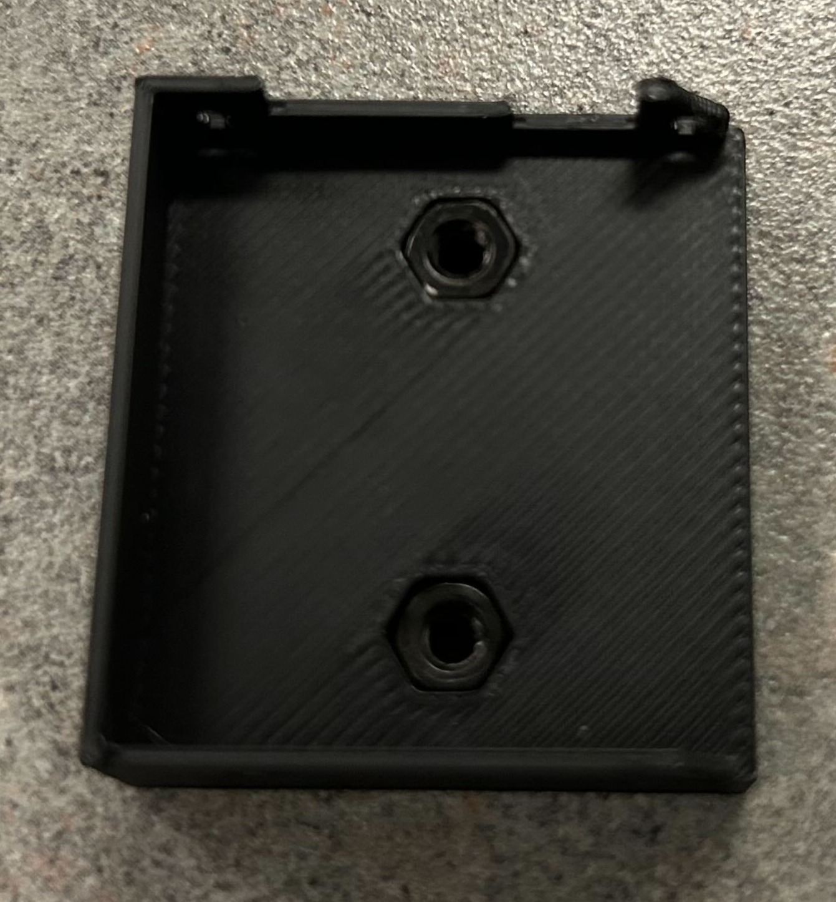
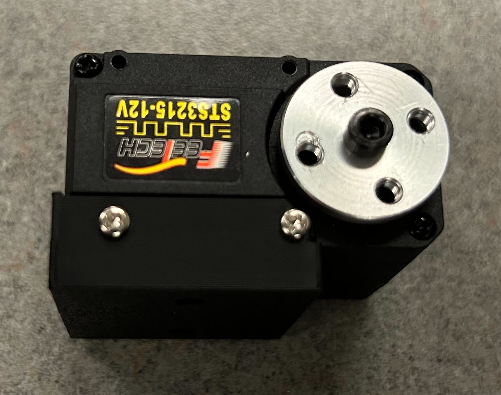
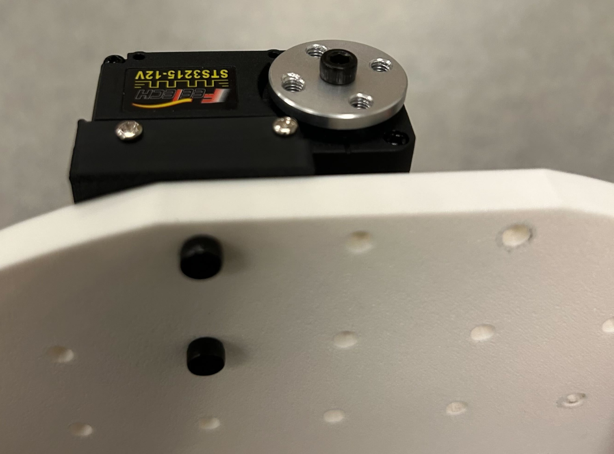
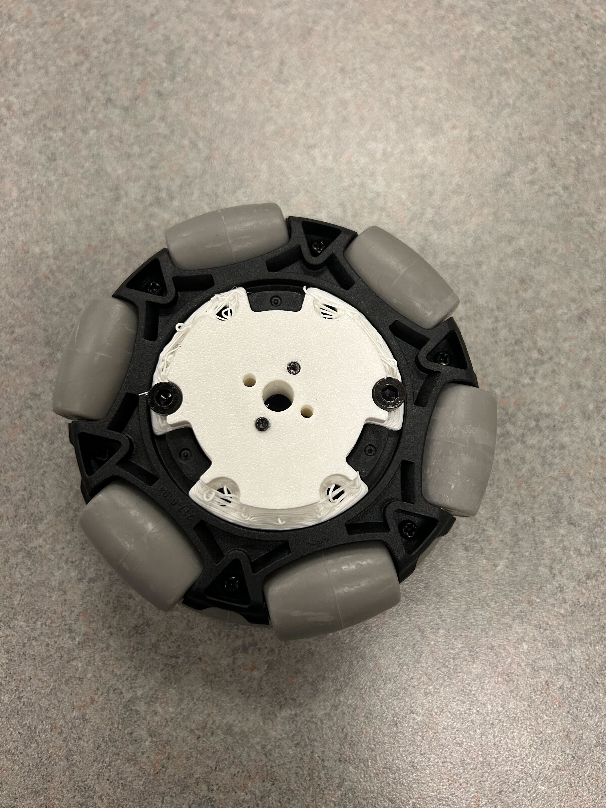
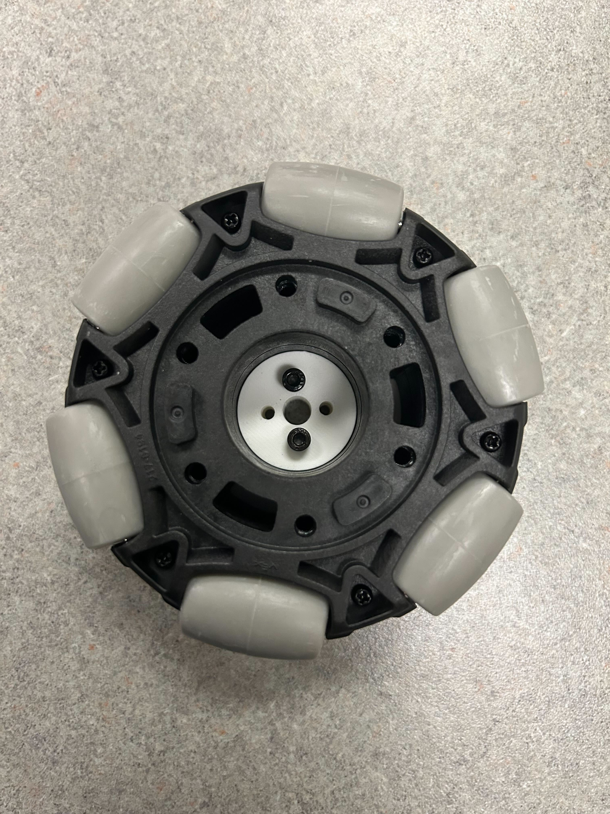
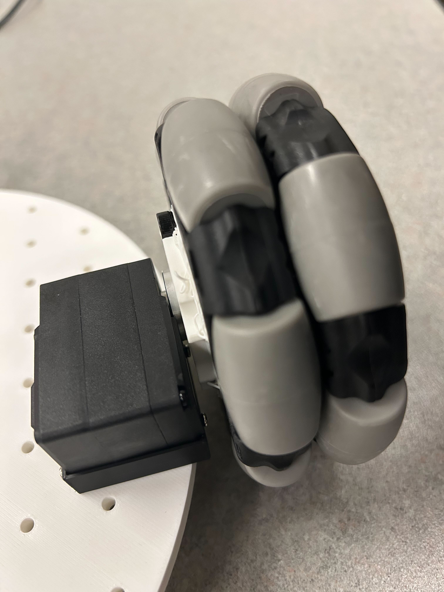
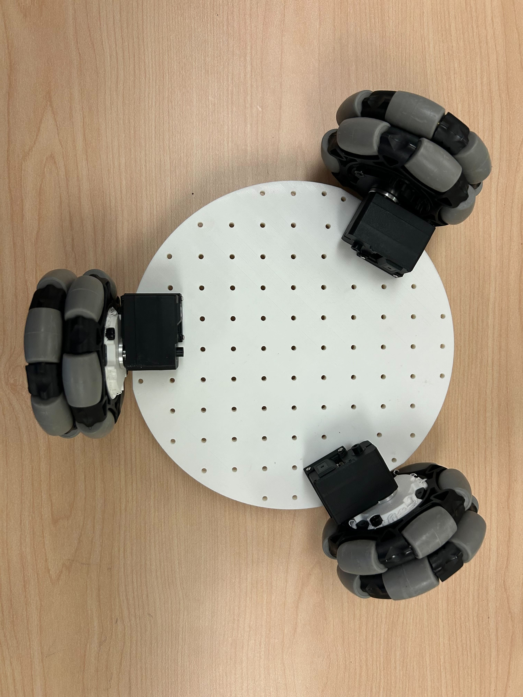
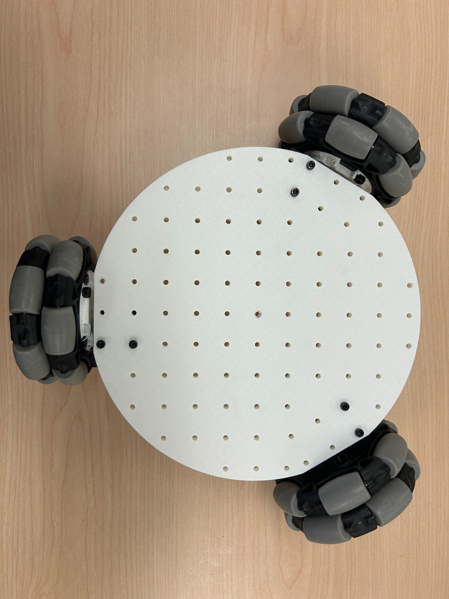
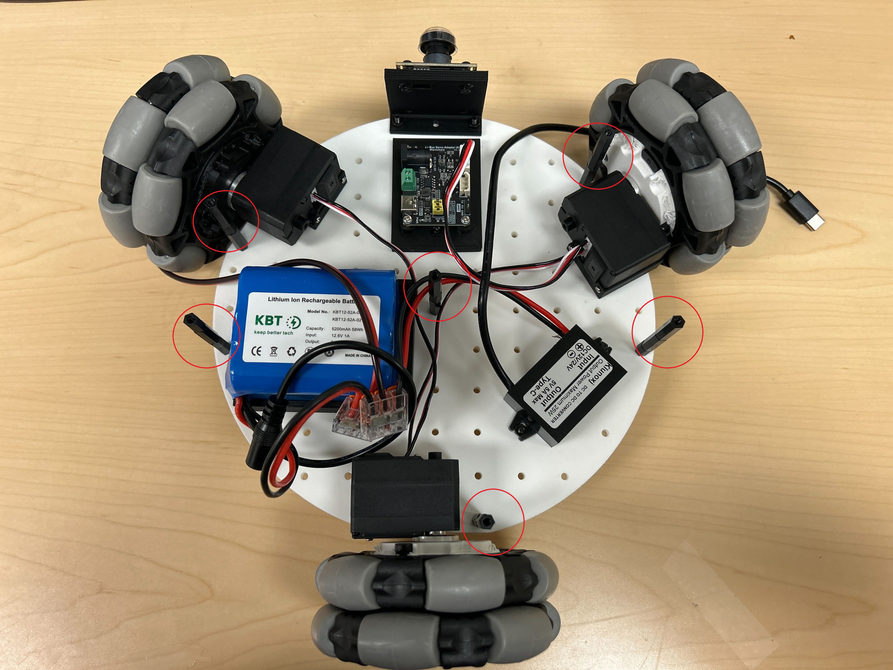
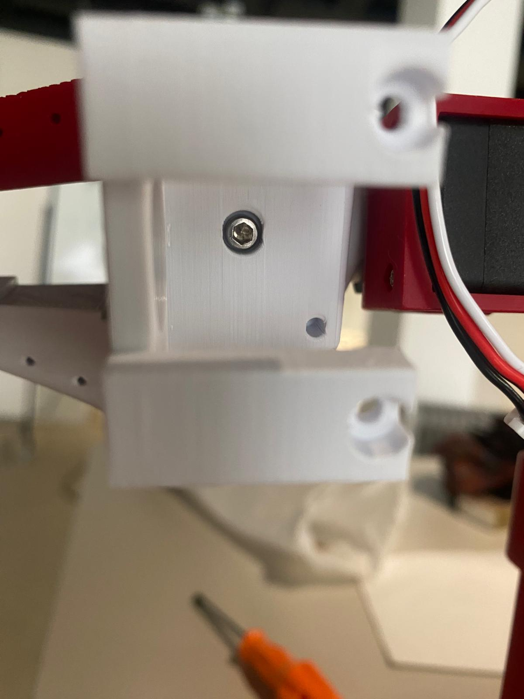

# Assembly
> **Estimated time:** 2 hours

*Exact component placements can be visualized in the [Fusion360 Online CAD](https://a360.co/4k1P8yO)*

*We assume you already have a [SO-100 Arm](https://github.com/TheRobotStudio/SO-ARM100) built*
### 1. Assemble Wheel Modules (3 per robot)

1. Insert m3 nuts into the hex slots on the drive motor mount.

    

2. Attach a feetech motor to the drive motor mount using 4 m2x5 tap screws. Also use 1 m3x6 machine screw to secure the servo horn to the motor.

    

3. Screw the drive motor mount onto the bottom base plate using 2 m3x12 machine screws.

    

4. Attach the wheel hub to the omniwheel using 2 m4x12 machine screws.

    

5. Screw the wheel hub onto the servo horn using 2 m3x16 machine screws.

     

With all 3 modules attached to the bottom base plate:

  

### 2. Bottom Plate Assembly
1. Insert m3 nuts into the mounts for the servo controller and battery mounts. Screw both onto the bottom base plate with 4 m3x12 machine screws.

     
2. Add the servo driver and attach the wires to the 3 drive servos.

    
3. Wiring Electronics
   - For the **12V version**: 
   Use the wago lever connectors to connect the ground and power battery wire leads to the leads of the 12v->5v converter and the dc barrel plug adapter. Screw on the 12v to 5v converter to the bottom base plate with 2 m3x16 machine screws and 2 m3 nuts.

         

    - For the **5V version**: you can use the powerbamk holder to keep the powerbank in place `3DPrintMeshes/5v_specific/5v_power_bank_holder.stl`. The powerbank can be mounted in the back on the lower plate.

        

### 3. Top plate Assembly
1. Place the raspberry pi 5 into the pi case bottom and snap on the top part of the case. 
2. Attach the Pi to the top base plate using 1 m3x12 machine screw(the second screw will be placed in with the standoffs) and mount the SO-100 arm with 4 m3x20 machine screws. Using our modified SO-100 base or the original will work as there are holes for both in the plate.

    

- For the **Wired version**: you can print these two parts: `3DPrintMeshes/wired_specific/cable_holder v0.stl` and `3DPrintMeshes/wired_specific/usb_connector_case v1.stl` and assemble them like the images below. It is **very important** to plug the usb-c cable in the way like the images. Thus the `UGreen` logo on the same side as `20GBS, 240W` logo side. And the `20GBS, 240W` side on top into your laptop. If the usb-c extenstion cable can't find your camera's or motor controller board, the cable orientation is probably wrong and should be flipped 180 degrees!

    Add cable holder and usb hub holder like this:

    

    Attach cables for 2 camera's motor control board and usb-c extender like this (important!):

    

     
     
     
    

### 4. Final Assembly
1. Attach 6 50mm standoffs to the bottom base plate with 6 m3x10 screws

    

2. Feed the servo controller usb-c to usb-a, 5v usb-c power, and so-100 servo wires through the hole in the top base plate. 

    

3. Mount the top base plate onto the standoffs with 6 m3x10 screws.

    

### 5: Attach Cameras
*Note: The mounts we designed are specific to the cameras we chose. They may need to be modified for different camera modules.*
#### (Option 1) Mounting Arducam
For these [camera's](https://www.amazon.com/Arducam-Camera-Computer-Without-Microphone/dp/B0972KK7BC) you can print these parts 1x `3DPrintMeshes/base_camera_mount.stl` and 1x `3DPrintMeshes/wrist_camera_mount.stl`.
1. Screw the base camera mount onto the bottom base plate(attach the arducam 5MP wide angle camera to the mount with 2 m2.5x12 machine screws). The cable for the camera mount can also be fed through the cutout

    
2. Screw the wrist camera mount to the static gripper using 4 m2x5 tap screws(attach the arducam 5MP wide angle camera to the mount with 2 m2.5x12 machine screws)

    

#### (Option 2) Mounting Webcam
For these [camera's](https://www.amazon.fr/Vinmooog-equipement-Microphone-Enregistrement-conférences/dp/B0BG1YJWFN/) you can print these parts 1x `3DPrintMeshes/webcam_mount/webcam_mount.stl`, 1x `3DPrintMeshes/webcam_mount/so100_gripper_cam_mount_insert.stl` and 1x `3DPrintMeshes/webcam_mount/webcam_mount_wrist.stl`. These can be used to attach a wrist and base camera to LeKiwi.

1. Print the new gripper with insert for the M3 nut, and insert the nut. Then insert the motor and attach gripper. 

    
2. Now take the camera mount `3DPrintMeshes/webcam_mount/webcam_mount_wrist.stl`, and add a M3x12mm bolt and screw it firmly until it locks with the M3 nut in the gripper. Then insert your camera in the mount and add 2x M3x35mm bolts in the back holes to lock the camera in place, use 2 nuts that you insert in the slots to lock the bolts.

    

3. Do the same for the base camera `3DPrintMeshes/webcam_mount/webcam_mount.stl` and attach it to the front of LeKiwi.

    

### Plug everything in and its ready!
Power the electronics by plugging in the DC barrel plug adapter to the servo motor controller and the 5v usb-c connector to the raspberry pi 5. The usb cables from the servo controller and the cameras can directly be plugged in to the raspberry pi.

 