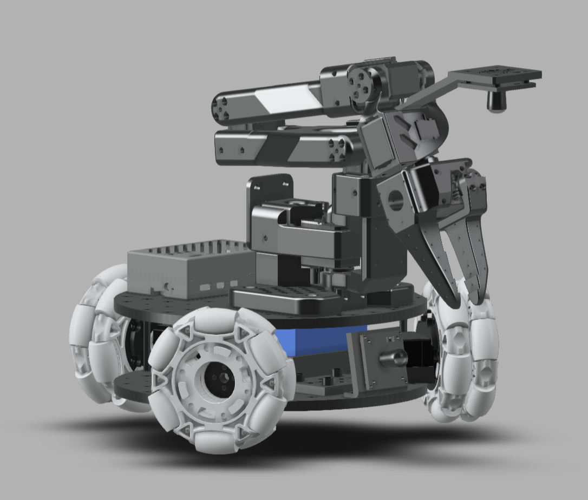

# LeKiwi
> LeKiwi - Low-Cost Mobile Manipulator | Version 1

  

## Quick Links
1. [Bill of Materials](BOM.md)
2. [3D Printing](3DPrinting.md)
3. [Assembly](Assembly.md)
4. [Fusion 360 CAD](https://a360.co/4k1P8yO)

## Hardware Design
#### Standardized Stacked Base Plates
- Inspired by the [open robotic platform](https://openroboticplatform.com/designrules), our base plates have with 3.5mm diameter holes spaced 20mm apart for standardized mounting

#### Power
- 12V 5A LiPo battery to power 12V ST3215 motors and converted to 5V 5A for the Rasberry Pi 5

#### Compute
- Raspberry Pi 5
- Streaming to a Laptop

#### Drive
- 3-wheel Kiwi (holonomic) drive with omni wheels

#### Robot Arm
- [SO-ARM100](https://github.com/TheRobotStudio/SO-ARM100)

#### Sensors
- Workspace camera
- Wrist camera

## Software Capabilities
Goals:
- Teleoperation with controller or laptop WASD + leader arm
- Data collection pipeline
- Streaming joint angles and camera feed

## Get In Touch!

Join the project on this [Discord server](https://discord.com/channels/1216765309076115607/1318390825528332371)! Let us know if you have any questions, suggestions, or other feedback.

## Main Contributors
Thank you to everyone who helped on the project!

**CAD Design**: Manav Chandaka, Bhargav Chandaka, Pepijn Kooijmans

**Software**: Pepijn Kooijmans, Gloria Wang, Bhargav Chandaka, Advait Patel
